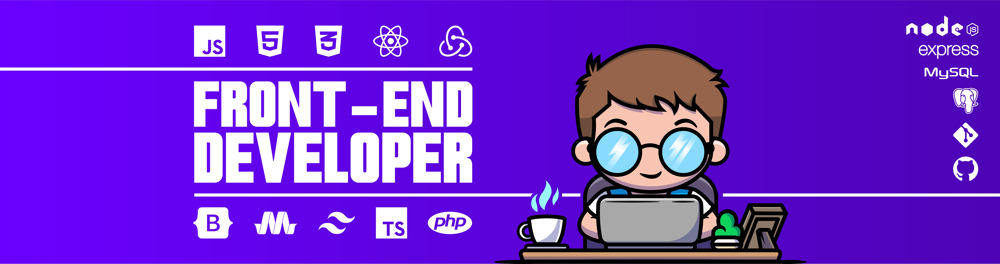

## 
Hola  soy Agustín, un apasionado desarrollador Frontend 🧑‍💻 sumando experiencia desde 2023 🚀

- 💼 Actualmente trabajando en Lightdata (Argentina)

- 👯 Busco colaborar en pequeñas aplicaciones freelance.

- 📫 Cómo contactarme: agusscaramello@gmail.com

- 📄 Conoce mis experiencias: <a href="https://drive.google.com/file/d/1TDhLRpN2Y0SlXm37RLtWJcY-59SfAZMW/view?usp=sharing" target="_blank">CV</a>

- 🚀 Siempre curioso por explorar nuevas formas de construir el frontend, desde lo clásico hasta lo más actual.

- ⚡ Interesado en liderar/coordinar proyectos

 

  

## Mis habilidades

### Frontend

### Backend

### DevOps

## Contactame

  

## Mis estadisticas de Github

    
   
   
  

